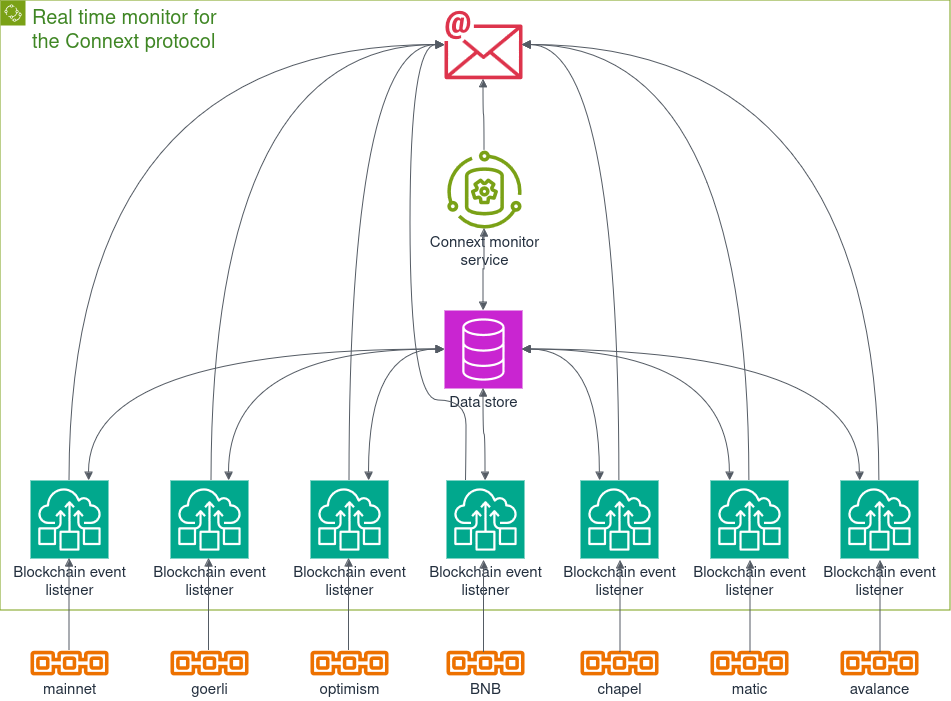

# Real time monitor for the Connext protocol

Indexes on-chain events generated by the protocol contracts in realtime, to monitor
active transfers, and show their current state in the transfer lifecycle.

## Implementation

### Connext monitor service

- Spawns blockchain event listeners per each configured blockchain network.
- Sends alerts when max wait time for transfer execution or reconciliation is breached.

### Blockchain event listener

- Reads `XCalled`, `Executed` and `Reconciled` logs of the Connext Core contract deployed to the given blockchain network.
- Indexes new transfers and updates the statuses of existing ones.
- Sends transfer status changes along with event latency metrics to the message channels.

### Message channels

Currently only email message channel is implemented.

## Setup

Set provider URLs in `data/chains.json`.

## Build

```
docker build -t image_name -f ./Dockerfile .
```
Replace `image_name` with the desired image name.

## Run

Set appropriate values to `POSTGRES_`, `DB_` and `EMAIL_` environment variables in `docker-compose.yml`.

Then run docker compose stack:

```
docker-compose up -d
or
docker compose up -d
```